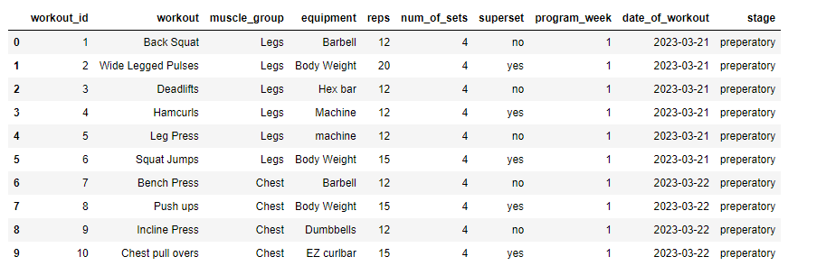
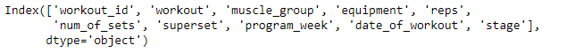
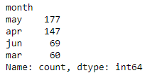
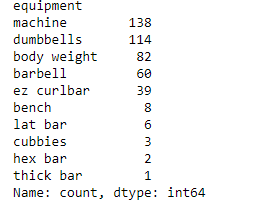
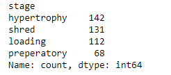

# Workout Program Data Analyst Project using __Python__
Data Analyst Project using Python with the Pandas, NumPy, and Seaborn libraries for a 12 week workout program that I made for myself. I will be using Git Hub and Git Bash for version control.

This project will be similar to the [this project](https://github.com/Romeeeo/Workout_Program_Data_Analyst_Project) that I did in the past. I will be using the same dataset, but will be using __Python__ to analyze the data.

## Introduction
In this case study, I will perform many real-world tasks of a junior data analyst at a fictional fitness company. In order to answer the key business questions, I will follow the steps of the data analysis process: [Ask](https://github.com/Romeeeo/Workout_Program_Python_Data_Analyst_Project/edit/main/README.md#ask), [Prepare](https://github.com/Romeeeo/Workout_Program_Python_Data_Analyst_Project/edit/main/README.md#prepare), [Process](https://github.com/Romeeeo/Workout_Program_Python_Data_Analyst_Project/edit/main/README.md#process), [Analyze](https://github.com/Romeeeo/Workout_Program_Python_Data_Analyst_Project/edit/main/README.md#analyze-and-share), [Share](https://github.com/Romeeeo/Workout_Program_Python_Data_Analyst_Project/edit/main/README.md#analyze-and-share), and [Act](https://github.com/Romeeeo/Workout_Program_Python_Data_Analyst_Project/edit/main/README.md#act).
### Quick Links
Data Source: For this project I took one of my 12 week workout programs and created a CSV from it. You can download the Data [Here](https://drive.google.com/uc?export=download&id=1AJovdTjjJM06A0DlkZkRYzWrUd2h6Tub)

Jupyter Notebook: [Jupyter Notebook](https://github.com/Romeeeo/Employee_exit_surveys/blob/main/employee_exit_survey.ipynb)


## Background

### Scenario
I am a junior data analyst working in the marketing analyst team at a fitness company. The director of marketing believes the company’s future success depends on maximizing the number people subscribing to their workout programas. Therefore, your team wants to understand the key components and valuable knowledge that is needed from a general 12 week program. From these insights, your team will design a new marketing strategy to bring in new subscribers. But first, the executives must approve your insights, so they must be backed up with compelling data insights and professional data visualizations.

## Ask
### Business Task
Devise insights on a 12 week program to allow people to better understand what is to come and what is needed.
### Analysis Questions
Three questions will guide the future marketing program:  
1. What are the key components of the 12 week workout program? 
2. What are the main equipments that are utilized in the program?
3. How do the different intensity levels differ in the program?  

The main objective is to provide insight on a simple 12 week program that everyone can follow.

The insights will help people ease in to a workout program with general valuble knowledge on what is to come, whether they are a beginner or are advanced.
## Prepare
### Data Source
For this project I took one of my 12 week workout programs and created a CSV from it. You can download the Data [Here](https://drive.google.com/uc?export=download&id=1AJovdTjjJM06A0DlkZkRYzWrUd2h6Tub)
### Data Organization
There is only one data file that consist of a workout program that spands over 12 weeks. The data consist of data such as the workout id, workout, muscle group, equipment, reps, number of sets, whether a workout is a superset or not, program week, date of a workout, and stage of the workout. The corresponding column names are workout_id, workout, muscle_group, equipment, reps, num_of_sets, superset, program_week, date_of_workout, stage.

## Process
I will be using the Jupyter Notebook with Python and utilizing both Pandas and NumPy for analyzing the data and Seaborn for data visualization.
### Reading in the CSV filee
```
import pandas as pd
import numpy as np
import seaborn as sns

df = pd.read_csv('Data/12wk_Program_RM_new.csv')
```
### Data Exploration
```
df.head()
```

Displays first five rows of data.

```
df.info()
```

Tells us info about the data in the dataset. __#__ of columns, Column __names__, __Non-Null Count__ for each column, and __data types__ for each column
```
df.isnull().sum()
```
Tells us how many __Nulls__ each column contain.
We can make the following observations based on the work above:
- The data seems to contain all of the necessary columns that we need to complete our analysis
- There seems to be no missing/Null data values. There are 453 rows of data and 453 non-null values for each column
### Data Cleaning
__Identify Missing Values and Drop Unnecessary Columns__

Since we need all of the necessary columns in the dataset, we will not be dropping any columns.

We will also not need to reread the data in identifying the null values as `NaN` as there are no Null values in the data.

Here is what the dataset looks like now:



Convert the data types:

```
df.convert_dtypes()
```

__Clean Column Names__
```
dete_survey_updated.columns = dete_survey_updated.columns.str.lower().str.strip().str.replace(' ', '_')
```
Running this line of code updates all column names to lowercase using `str.lower()`, remove leading and trailing whitespaces `str.strip()`, and replace all spaces with `_` using `str.replace(' ', '_')`

We can check the new column names by running:
```
df.columns
```

Here are the column names for the dataset:



We now need to convert the `date_of_workout` column to __datetime__ as this is the only column that is of that datatype.

```
df['date_of_workout'] = pd.to_datetime(df['date_of_workout'])
```
__Create a new column__

We will also create a new column for the month that the workout takes place. There should only be four months (Mar, Apr, May, Jun).

```
# Convert the months into string values
def tranform_month(val):
    if val == '3':
        return "mar"
    elif val == '4':
        return "apr"
    elif val == '5':
        return "may"
    elif val == '6':
        return "jun"
    else:
        return np.nan
df['month'] = df['month'].apply(tranform_month)

# Quick check of the update
df['month'].value_counts()
```

Here are the value counts for the `month` column:



I will also change the `workout_id` column to match the index using a function and applying it to that column.

```
# Change all of the workout id's to match the index
def chng_to_index(val):
    return val - 1

df['workout_id'] = df['workout_id'].apply(chng_to_index)
```

__Clean Row Values__

Change all of the values to be lowercase.

```
# Applying lowercase transformation to all values
df = df.applymap(lambda x: x.lower() if isinstance(x, str) else x)
```


__Filter the Data__

Remove all null values:

```
df.dropna()
```

Dropping all of the duplicates based on the column, `workout_id`:

```
df = df.drop_duplicates(subset=['workout_id'])
```

Check the unique values for the `muscle_group` column in the dataset.

```
df['muscle_group'].value_counts()
```

Here we can see that there are __7__ muscle groups that we work on in this program. The muscle groups are __legs__, __abs__, __back__, __chest__, __shoulders, triceps__, and __biceps__


We can check to see which equipment is used throughout the program:

```
df['equipment'].value_counts()
```

Here is the list of all the equipment used:



List of the stages for the program:

```
df['stage'].value_counts()
```



__Verify the Data__

We will now check the min and max of the number of sets for each workout, should be greater than __0__

```
# Check the range of num_of_sets column
min_value = df['num_of_sets'].min()
max_value = df['num_of_sets'].max()

print("Range for number of sets throughout the workout program {}-{}:".format(min_value,max_value))
```

Here we can see that the range is __2-6__.

Make sure that there is only 12 weeks in the program:

```
max_week = df['program_week'].max()

print("Max week:", max_week)
```

Check the ranges for `reps` also:

```
min_value = df['reps'].min()
max_value = df['reps'].max()

print("Range for number of reps throughout the workout program {}-{}:".format(min_value,max_value))
```

__Number of workouts__ each month:

```
df['month'].value_counts()
```


Percentage of workouts for each muscle group:

```

```


